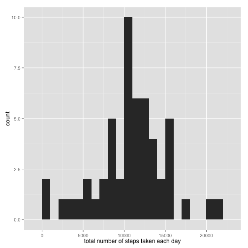

Reproducible Research: Peer Assessment 1
========================================================
Author: Krisztian Gyuris

## Loading and preprocessing the data

```r
data <- read.csv('activity.csv')
```


## What is mean total number of steps taken per day?

```r
library(ggplot2)

total_steps <- tapply(data$steps, data$date, sum)
head(total_steps)
```

```
## 2012-10-01 2012-10-02 2012-10-03 2012-10-04 2012-10-05 2012-10-06 
##         NA        126      11352      12116      13294      15420
```

```r
tail(total_steps)
```

```
## 2012-11-25 2012-11-26 2012-11-27 2012-11-28 2012-11-29 2012-11-30 
##      11834      11162      13646      10183       7047         NA
```

```r
qplot(total_steps, binwidth=1000, xlab="total number of steps taken each day")
```

 

```r
mean(total_steps, na.rm = TRUE)
```

```
## [1] 10766.19
```

```r
median(total_steps, na.rm = TRUE)
```

```
## [1] 10765
```

## What is the average daily activity pattern?


## Imputing missing values


## Are there differences in activity patterns between weekdays and weekends?
